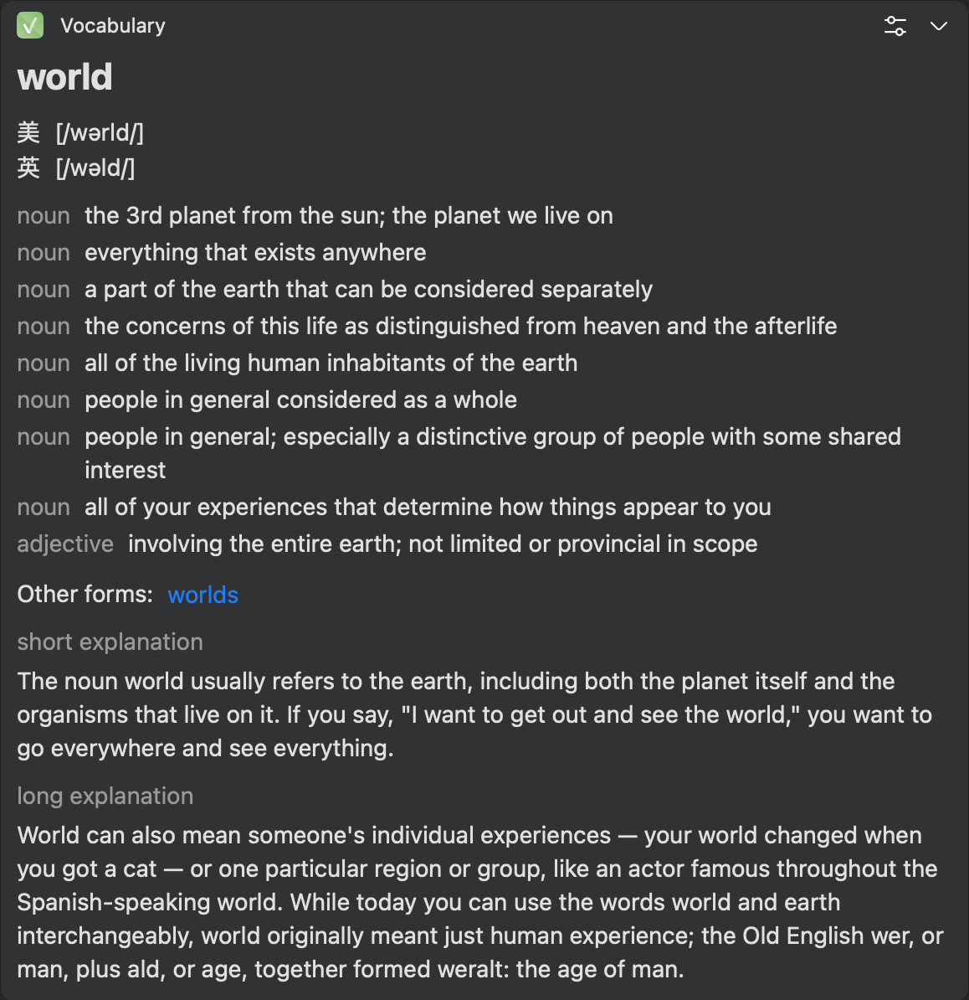

 
<h1>

  
   bob-plugin-vocabulary.com
</h1>

    

    基于 vocabulary.com 的英英词典Bob插件
     

  <a href="#关于">关于</a> •
  <a href="#如何使用">如何使用</a> •
  <a href="#编译打包">编译打包</a> •
    <a href="#todo">TODO</a>

  

                                                                                                                             

## 关于
Bob 是一款 macOS 平台的 翻译 和 OCR 软件

本插件基于 vocabulary.com 提供的英文单词的英文释义

## 如何使用
1. 安装 Bob 软件
2. Release 中下载以 bobplugin 结尾的文件
3. 双击安装
4. 选择偏好的发音来源

## 编译打包
1. Bob文档 - [开发插件](https://bobtranslate.com/plugin/)
2. 根目录下执行 `node build.js` 自动打包为 bob 插件，打包路径为 `./release` 

## TODO
1. 因为释义来源与发音来源不同，若使用有道发音，概率出现发音为空